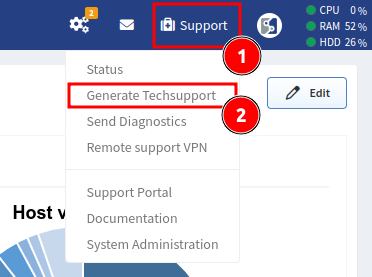

# Techsupport

!!! info

    The Techsupport file from the IP Fabric is one of many ways how you can
    share the discovered data with our support team and engineers. This
    quick tutorial demonstrates how to generate the file and share it with
    us. The Techsupport file is encrypted. Only IP Fabric support staff is
    able to decrypt the data.

<iframe width="560" height="315" src="https://www.youtube-nocookie.com/embed/SJZAzYAuXrE" title="YouTube video player" frameborder="0" allow="accelerometer; autoplay; clipboard-write; encrypted-media; gyroscope; picture-in-picture" allowfullscreen></iframe>

## Generating Techsupport File

Go to **Support -> Generate Techsupport**

Select data to be included in a Techsupport file (leave in default when in doubt)

## Uploading a Techsupport File

### WEB / HTTPS

Please, visit [https://upload.ipfabric.io](https://upload.ipfabric.io) with
your browser. User and password are provided by technical support.

### FTP

Open [ftp://upload.ipfabric.io](ftp://upload.ipfabric.io) with your `ftp`
client. User and password are provided by technical support.

## What Is Included In The Techsupport File?

1.  **System logs** -- Includes `syslog`, `dmesg`, RabbitMQ, MongoDB,
    ArangoDB and IP Fabric API service logs. Customer data are **not**
    included.
2.  **Service logs** -- Includes IP Fabric discovery service logs without
    CLI. Customer data are limited, only IP addresses which were used
    during discovery and serial numbers of devices.
3.  **Current Snapshot** -- Includes selected snapshot
    - **Remove CLI logs from snapshot** -- Removes devices CLI logs from snapshot
    - **Database dump** -- Includes database dump of selected snapshot.
4.  **Complete database dump** -- Includes database dump of all snapshots
    which are loaded in memory
5.  **Database dump without devices data** -- Removes all collected data
    from devices. Dump contains only error and service tables.

!!! info

    Snapshot and database dump doesn't include any customer credentials (passwords, keys etc.)
