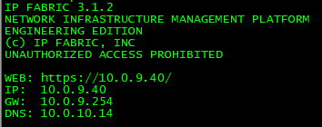

# Command Line Interface

## Command Line Interface

The command-line interface is a secondary service interface in IP Fabric VM which serves troubleshooting and testing purposes. For example, for testing authentication credentials from the specific IP address of IP
Fabric VM, in case of address-restricted access. The CLI interface is the main tool in servicing the system by the support teams.

A first boot wizard can be used to change system settings, such as IP addressing parameters, domain names, NTP, system proxy settings, or a user's password. To launch First Boot Wizard again, connect via SSH to IP Fabric as ***osadmin*** user, launch ipfabric-net-wizard and then reboot the system.

Command-line also allows the use of the standard networking tools, such as telnet, ssh, traceroute or ping.

## Troubleshooting VM network problems using IP Fabric CLI

In the event of a VM network connection problem, DNS issues, network devices connectivity issue, IP Fabric CLI is a useful helper.

CLI can be also used to access system and application logs as well as snapshot files.

### System and application logs

System and application logs are placed in ***/var/log*** folder. Specifically IP Fabric application logs can be found in:
``` bash
/var/log/nimpee.
```

### Snapshots

Snapshots are available in ***osadmin*** home directory ***/home/osadmin/snapshots***. Each folder inside represents one snapshot. Even if snapshots can be copied manually using SCP or SFTP it's strongly recommended to use the export feature in web UI.

### Checking the network interface settings

!!! warning
    When you log in through a VM console or SSH, network settings are displayed. This content is static, generated when VM boots! When DHCP is used, an IP address can change in some cases.

    

To display actual IP address use command:

``` shell
ip addr show
```

Default gateway and other routes (if configured) can be check as follows:

``` shell
ip r
```

### Checking DNS

DNS can be checked using the ***dig*** or ***nslookup*** command.

For example, let's check A record and PTR (reverse) record of some device using ***dig***.

For A record check ***ANSWER*** which contains requested IP address. Also ***SERVER*** section below is  important as it tell us what DNS server answered our DNS query.


For PTR record check ***ANSWER*** which contains requested domain name.


If you prefer ***nslookup*** you can achieve the same results.


### Testing connectivity to a network device

The very basic test is ***ping*** or ***traceroute***.

!!! warning ICMP
    Please bear in mind that ICMP packets used by ***ping*** and ***traceroute*** can be blocked by ACL or firewall. It does not mean that a device cannot be reached using SSH or telnet.

To make sure that the network device is available from IP Fabric VM, you
can use the ***telnet*** and ***ssh*** client from the command line.

For SSH use:

``` bash
ssh userName@device-IP-or-Hostname
```


For telnet use:

``` shell
telnet device-IP-or-Hostname
```


### Reboot and shutdown

IP Fabric VM can be also rebooted or shutdown using CLI.

For VM reboot just use ***reboot*** command without any parameters.

For VM shutdown use ***shutdown*** command without any parameters.

  
