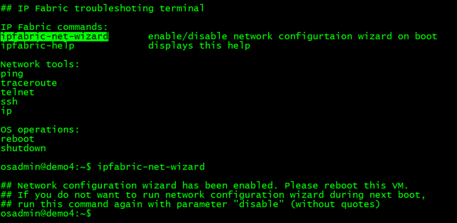

# Reinitiate system 'Boot Wizard'

The Boot Wizard needs to be completed during the IP Fabric virtual
server deployment before the image installation begins. [The Boot Wizard
introduces the configuration of basic network
parameters](https://ipfabric.atlassian.net/wiki/spaces/ND/pages/901808145/Deploying+VMware+OVA+virtual+machine#Complete-first-boot-wizard),
including time zone, NTP, IP address, DNS or Proxy settings.  
In case some of the initial parameters need to be modified after the
installation is complete, the IP Fabric administrator may reinitiate the
Boot Wizard by completing the following procedure.


!!! Warning
    Direct access to the virtual machine console is required after reboot

## **1 - Login as ‘osadmin’ via SSH and re-enable Boot Wizard and reboot**


``` jscript
osadmin@demo4:~$ ipfabric-net-wizard

## Network configuration wizard has been enabled. Please reboot this VM.
## If you do not want to run network configuration wizard during next boot,
## run this command again with parameter "disable" (without quotes)

osadmin@demo4:~$ reboot
```

After rebooting the IP Fabric server the virtual machine will
automatically jump into the Boot Wizard.

## **2 - Access the VM hypervisor console and modify parameters in the Boot Wizard**

Follow the Boot Wizard steps to update the settings.

<https://ipfabric.atlassian.net/wiki/spaces/ND/pages/901808145/Deploying+VMware+OVA+virtual+machine#Complete-first-boot-wizard>
