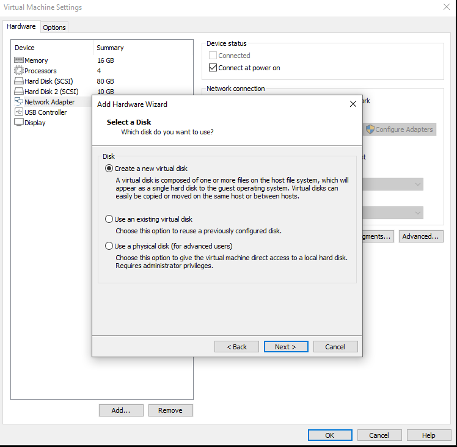
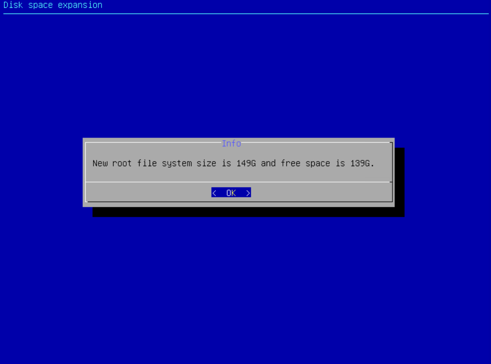
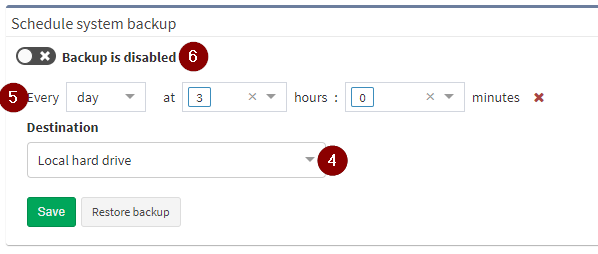

## Backup

Use IP Fabric backup to protect your important data.

There are two types of backup:

-   Local backup

-   Remote backup (FTP, sFTP)

!!! tip Security tip

    Backups are encrypted with *osadmin *user password configured during the [first boot wizard](https://ipfabric.atlassian.net/wiki/spaces/ND/pages/78872592).
    When you lose *osadmin *user password, backups are also lost!

### Local backup

Local backup saves database, user and system files locally on a
dedicated backup volume. It's highly recommended placing backup volume
on different datastore ideally on different physical storage.

**Backup Disk**  
The backup disk is not present by default! Please add a new virtual disk
to enable local backups. (See steps below)

#### Adding a new virtual disk to your IP Fabric VM as a local backup disk

1.  Open your VM platform.

2.  Go to IP Fabric VM settings and add *New* *Hard Disk*

3.  Select size of a new disk

4.  Specify the type of a new disk (for the backup volume it is
    recommended to select a virtual disk on a different datastore
    ideally on different physical storage)

    

5.  Finish configuration wizard.

6.  Launch Remote (Web) Console.

7.  [Reboot](https://ipfabric.atlassian.net/wiki/spaces/ND/pages/79036518/Service+Interfaces) (*Send Ctrl+Alt+Delete* function can be also used) or power on IP Fabric VM.

8.  During system boot, a *Disk space expansion* wizard appears.  

    

9.  Select *Yes* to start disk space expansion.

10. Expand the new volume as a backup (Backup is used only for local
    backups).

11. Selected volume is extended.  

    

12. Enter *OK*

### Automatic Local Backups

To schedule automatic local backups do the following steps:

1.  Add dedicated backup volume if not available - see steps above.

2.  Login to the user interface.

3.  Go to ***Settings → Advanced → System → Schedule system backup**.*

4.  Change ***Destination*** to ***Local hard drive***.

5.  Set a backup schedule. See example for "Every day at 3:00".

6.  Enable backup

    

### Remote backup

Remote backup saves database, user and system files remotely using FTP
or sFTP protocol.

!!! note

    This is a recommended type of backup.

!!! warning

    A directory **has to be specified** for FTP and SFTP backups

To set up remote backup do the following steps:

1.  Login to the user interface.

2.  Go to ***Settings → Advanced → System → Schedule system backup**.*

3.  Enable backup

4.  Change ***Destination*** to ***FTP*** or ***SFTP**.*

5.  Set a backup schedule. See example for "Every day at 5:15 and 17:15
    (for setting more options, please, hold SHIFT during selection)".

    

6.  Change ***Destination*** to ***FTP*** or ***SFTP**.*

7.  Enter remote FTP/SFTP ***Server*** FQDN or IP address. Make sure
    that your DNS client is configured and working properly in case of
    FQDN.

8.  Enter ***Username*** to access FTP/SFTP server.

9.  Enter ***Password*** to access FTP/SFTP server.

10. Specify a ***Directory*** where FTP/SFTP backup should be uploaded.

11. Click ***Save ***(The IP Fabric platform will immediately test the
    connection)

12. IP Fabric tries to reach FTP/SFTP server with configured parameters.

!!! warning

    FTP/SFTP user needs read, write, list and delete permissions.

!!! info

    From version 4.1.1 onward we do not check validity of SSL certificates during FTP backups.

### Trigger a backup manually (on-demand)

Both types of backup can be also triggered manually on demand. This is
useful for example before a system upgrade.

Manual backup can be triggered from IP Fabric Administrative interface:

1.  Login to admin interface (for
    example [https://ipfabric.example.com:8443)](https://nimpee.example.com:8443))

2.  Go to ***Restore or Backup***

3.  Select ***Backup*** from ***Do you wish to proceed with a backup or
    restore?*** drop-down menu.

4.  For local backup select ***Local hard drive*** from the ***Backup
    files destination***.

5.  For remote backup select ***FTP*** or ***SFTP ***from the ***Backup
    files destination***.

    1.  Enter remote FTP/SFTP ***Server*** FQDN or IP address. Make sure
        that your DNS client is configured and working properly in the
        case of FQDN.

    2.  Enter ***Username*** to access FTP/SFTP server.

    3.  Enter ***Password*** to access FTP/SFTP server.

    4.  Specify a **Directory** where FTP/SFTP backup should be
        uploaded.

6.  Click ***Next***

## Restore

In case of database or system corruption, IP Fabric can be restored from
a backup.

!!! info

    Restore is supported only to the same version of IP Fabric as source of
    a backup. This is checked automatically during restore.

    The only exception are snapshots which can be restored to any version of
    IP Fabric appliance.

### Restore from local hard drive

1.  Login to admin interface (for
    example [https://ipfabric.example.com:8443)](https://nimpee.example.com:8443))

2.  Go to ***Restore or Backup***

3.  Select ***Restore** *from ***Do you wish proceed a backup or
    restore?*** drop down menu.

4.  Select ***What restore?***. There are four options:

    1.  ***Restore data & all system services*** - This option restores
        database and system files. It's usable for restore from general
        system failures or upgrade failures.

    2.  ***Restore database*** - it means that only database data are
        restored. It can be sufficient in case of database failure or
        accidental database drop.

    3.  ***Restore syslog data*** - it means that only syslog data are
        restored. It can be sufficient in case of database failure or
        accidental database drop.

    4.  ***Restore snapshot file*** - particular snapshot can be
        restored.

5.  For restore from local backup choose ***Local hard drive*** from
    ***Backup files source***.

6.  Click ***Next***.

7.  ***Select backup file*** - there is year, month, day and time when a
    backup file was created in a backup filename.

8.  Click ***Restore***.

!!! warning

    Backups are encrypted with ***osadmin*** user password configured during the [First Boot Wizard](https://ipfabric.atlassian.net/wiki/spaces/ND/pages/901808145/Deploying+VMware+OVA+Virtual+Machine). When you loose ***osadmin*** user password, all backups encrypted by this password are lost.

### Restore from remote server

1.  Login to admin interface (for
    example [https://ipfabric.example.com:8443)](https://nimpee.example.com:8443))

2.  Go to ***Restore or Backup***

3.  Select ***Restore** *from ***Do you wish proceed a backup or
    restore?*** drop down menu.

4.  Select ***What restore?***. There are four options:

    1.  ***Restore data & all system services*** - This option restores
        database and system files. It's usable for restore from general
        system failures or upgrade failures.

    2.  ***Restore database*** - it means that only database data are
        restored. It can be sufficient in case of database failure or
        accidental database drop.

    3.  ***Restore syslog data*** - it means that only syslog data are
        restored. It can be sufficient in case of database failure or
        accidental database drop.

    4.  ***Restore snapshot file*** - particular snapshot can be
        restored.

5.  For restore from local backup choose ***FTP*** or ***SFTP*** from
    ***Backup files source***.

6.  Specify ***Server*** FQDN or IP address. Make sure that your DNS
    client is configured and working properly in case of FQDN.

7.  Enter ***Username***** **to access FTP/SFTP server.

8.  Enter ***Password***** **to access FTP/SFTP server.

9.  If you would like to use different ***Directory***** **than
    FTP/SFTP root please specify.

10. Click ***Next***.

11. ***Select backup file*** - there is year, month, day and time when a
    backup file was created in a backup filename.

12. Click ***Restore***.

!!! warning

    Backups are encrypted with ***osadmin*** user password configured during
    the [First Boot Wizard](https://ipfabric.atlassian.net/wiki/spaces/ND/pages/901808145/Deploying+VMware+OVA+Virtual+Machine).
    When you loose ***osadmin*** user password, all backups encrypted by
    this password are lost.
