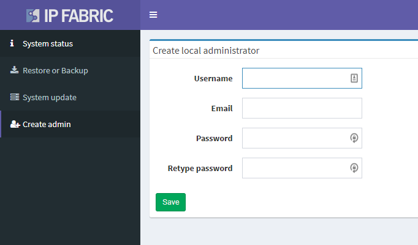

# Create Local Administrator

Last thing that System Administration offers is an ability to create a new local administrator account (change of password of an already existing user is not possible here). Creation of a new user and password recovery is possible only in **Setting → User Management** menu in the main IP Fabric interface.

